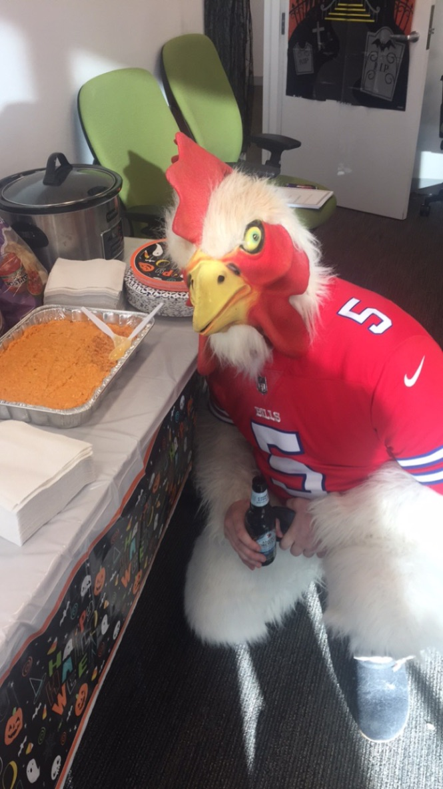

###___adam___

I like to write about baseball, stats, and a psuedorandom assortment of other topics. When I'm not watching baseball, chances are I'm coding, playing board games, reading a fantasy novel, or watching some other sport (honestly just football). 

Some Thoughts:
- post-season is a crapshoot. ask anybody
- more strike-outs is a fair trade for more home runs. home runs are fun
- math is more fun on a computer than on a chalkboard
- boromir isn't evil, nor is frodo boring
- any data project without visualization isn't complete

I'm a Yankees and Bills fan living in Boston. I guess I root for the Nets, in a distant, I hear they're fun sorta way. 

